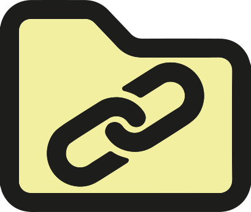

<div id="top"></div>

<br />
<div align="center">
  <a href="https://github.com/github_username/repo_name">
    
  </a>

<h3 align="center">IPA Linkpinnwand-Webseite</h3>

<p>Vue JS<br />
Frontend des Gesamtprojektes
</p>

  <p align="center">
    Projekt Beschreibung
    <br />
    Die Webseite soll für die Sammlung nützlicher und interessanter Links sein. (Z.B. Tutorials, Infos, Best Practices usw.)
    Für jeden Link der eingeben wird der Titel, die Beschreibung und ein Bild automatisch abgefragt und gespeichert.
  </p>
</div>

<details>
  <summary>Inhaltsverzeichnis</summary>
  <ol>
    <li>
      <a href="#projekt-setup">Projekt Setup</a>
    </li>
    <li>
      <a href="#erstellt-mit">Erstellt mit</a>
    </li>
    <li>
      <a href="#projekt-setup">Projektaufbau</a>
      <ul>
        <li><a href="#home-seite">Home-Seite</a></li>
        <li><a href="#info-Seite">Info-Seite</a></li>
        <li><a href="#detail-seite">Detail-Seite</a></li>
        <li><a href="#erstell-seite">Erstell-Seite</a></li>
        <li><a href="#editier-seite">Editier-Seite</a></li>
        <li><a href="#impressum-seite">Impressum-Seite</a></li>
        <li><a href="#komponenten">Komponenten</a></li>
      </ul>
    </li>
    <li>
      <a href="#version">Version</a>
    </li>
    <li>
      <a href="#updates">Updates</a>
    </li>
          <ul>
        <li><a href="#version-1.0">Version 1.0</a></li>
        <li><a href="#version-2.0">Version 2.0</a></li>
        <li><a href="#version-3.0">Version 3.0</a></li>
        <li><a href="#version-4.0">Version 4.0</a></li>
        <li><a href="#version-5.0">Version 5.0</a></li>
        <li><a href="#version-5.0">Version 6.0</a></li>
      </ul>
  </ol>
</details>

## Projekt Setup

Alle Befehle sind ebenfalls mit yarn möglich.

Mit dem unten stehenden Befehl werden alle notwendigen Node JS Module installiert.

- npm

  ```sh
  npm i
  ```

  oder

- npm

  ```sh
  npm install
  ```

<p align="right">(<a href="#top">back to top</a>)</p>

## Test Funktionalität

Projekt laufen lassen

- npm

  ```sh
  npm run serve
  ```

Nun sollte das Projekt im Browser zu sehen sein.

```sh
http://localhost:1337/
```

Vergessen Sie nicht, dass auch das Backend (Strapi) welches zu diesem Projekt gehört laufen sollte. Sonst sehen sie keinen Content. Weil er nicht aus der Datenbank ausgelesen werden kann.

<p align="right">(<a href="#top">back to top</a>)</p>

## Erstellt mit

- [Vue.js](https://vuejs.org/)

<p align="right">(<a href="#top">back to top</a>)</p>

<!-- GETTING STARTED -->

## Projekt Aufbau

### Home-Seite

Auf der Home-Seite befindet sich eine Liste mit allen Links der Seite. Mit Hilfe der Suche kann man nach Link Titeln suchen. Der Kategorienfilter ermöglicht es jeweils nur eine Kategorie von Links anzuzeigen.

### Info-Seite

Die Info-Seite hat einen Beschreibt des Projektes.

### Detail-Seite

Auf der Detailseite wird zum Titel und Bild auch die Beschreibung des jeweiligen Links angezeigt. Des weiteren gibt es das Icon welches anzeigt zu welcher Kategorie der Link gehört und drei Buttons. Einen zum Löschen, der einen auf eine Löschen Seite weiterleitet, auf der man bestätigen muss, ob man den Link wirklich löschen möchte. Einen zum Editieren mit Weiterleitung auf die Editierseite, welche weiter unten beschrieben ist und einen zur Seite Button. Dieser leitet den Nutzer auf die eigentliche Seite.

### Erstell-Seite

Die Erstell-Seite enthält ein Formular mit Vier Input-Feldern, einen Autofill-Button, einem Select-Feld, und einem Erstell-Button. Das erste Input-Feld ist für die URL. Hat man die URL eingegeben kann man mit dem Autofill Button eine Abfrage nach Titel, Beschreibung und einem Bild Link starten. Im Select-Feld sind die zur Verfügung stehenden Kategorien aufgelistet.

### Editier-Seite

Die Editier-Seite ist genau gleich wie die Erstellseite aufgebaut. Nur sind hier die Daten die man Editieren möchte in den Input-Feldern.

### Impressum-Seite

Impressum

### Komponenten

LinkCard ist die Kacheln die für jeden Link, aus dem API Request von Strapi, auf der Startseite generiert wird. Auf der Kachel sind jeweils der Titel, Bild und das Icon. Es gibt zwei Button, einen für Details und einen für zur Seite. Details hat eine Weiterleitung auf Detailseite und zur Seite eine Weiterleitung auf die jeweilige Seite.

<p align="right">(<a href="#top">back to top</a>)</p>

## Version

Aktuelle Version 1.0

<p align="right">(<a href="#top">back to top</a>)</p>

## Updates

### Version 1.0

- Links Erstellen mit automatischer auslese von Titel, Beschreib und einem Bild Pfad.
- Links können editiert und gelöscht werden
- Detailseite für jeden Link
- Suche nach Linktiteln
- Filter nach Kategorien, nur jeweils eine Kategorie geleichzeitig
- Klicks werden gezählt
- Ranking nach Anzahl der Klicks

### Version 2.0

- Suche auch nach Beschreibung
- Filter ausbauen
- Klick Ranking ein- und ausschaltbar
- nach mehrere Kategorien filtern
- Nach Klicks filtern mit einem Schieberegler
- Login, Passwörter und Benutzernamen vor definiert
- Like Funktion

### Version 3.0

- Nutzer können selber Benutzer erstellen
- Nutzer können Passwörter und Benutzernamen ändern
- Nur E-Mails gewissen Endungen können Accounts erstellen

### Version 4.0

- Benutzergruppen
- Verschiedene Bereiche für Links
- Mann kann verschiedene Gruppen angehören, die unterschiedeliche Berechtigungen haben
  Jeder
- Jeder Nutzer kann eigene Bereiche erstellen, zu denen er andere Nutzer einladen kann.
- Ideen-Seite: Die Nutzer können Vorschläge für zukünftige Funktionen posten und diese liken und kommentieren.

### Version 5.0

- Per Drag and Drop Sachen verschieben
- Q&A-Seite: Nutzer können Fragen, ob jemand einen Link zu einem bestimmten Thema/Problem hat.
  Fragen können auch Kategorien zugewiesen werden und danach gefiltert werden. Nutzer können einen oder mehrere Links an die Frage hängen und diese Kommmentieren.
- Bereiche für Kunden, in denen sie Links ablegen können: Für Beispiel-Seiten die ihnen gefallen.

### Version 6.0

- Chrome Extension

<p align="right">(<a href="#top">back to top</a>)</p>
